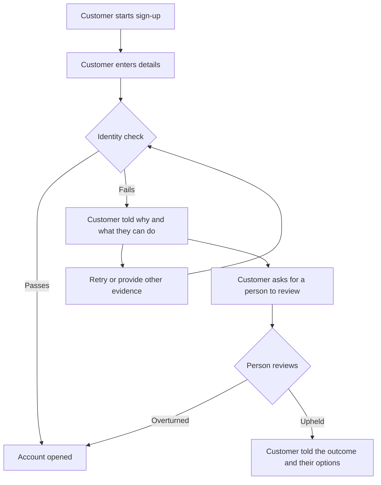

# Problem brief: <title>

**Owner:** <product lead>  **Date:** <date>  **Status:** draft / ready for workshop

## Customer
Who are they, and what are they trying to do?

## Problem
What is going wrong for the customer? Write it in plain language, so that anyone in your industry could read it and understand it. No internal jargon, code names or unexplained acronyms. Use a number where you can.

## Evidence
How do we know? List each source and what it showed. Prefer more than one method.

| Method | Source and date | What it showed |
|---|---|---|
| Measured failure in the current system | e.g. drop-out rate at each step of the process | |
| Customer survey | e.g. sample size, questions asked | |
| Customer interviews | e.g. number of interviews, who | |

If one method is missing, say what it would add.

## Outcome
What would be true if this were solved? How will we measure it, and where are we today?

| Outcome | Measure | Baseline (today) | Target |
|---|---|---|---|
| e.g. more customers finish onboarding | e.g. % who start onboarding and do not finish | e.g. measured over the last 90 days | |

Say how approaches will be compared, for example an A/B test, or a before and after comparison if there are too few customers for a fair test. Do not choose the approach here.

## Customer workflows
How does a customer transact, start to finish? Show the happy path and where each failure branches off. Keep it at the customer level: what they do and see, with no systems or technology.

## Unhappy paths
What happens when it goes wrong for the customer? For each failure, say what the customer sees, what they can do next, and how they reach a person to challenge an automated decision.

| Failure | What the customer experiences | Next step for the customer | Who handles it, and how fast |
|---|---|---|---|
| e.g. identity (KYC) check fails | | e.g. retry, other evidence, or ask for a person to review | |

Also say what we will track, for example failures, challenges, challenges upheld, and time to resolve.

## Constraints
Cost, deadlines, compliance, performance, dependencies, anything the solution must respect.

## Out of scope
What we are deliberately not solving.

## Open questions
What we do not yet know.

## Suggestions (optional, non-binding)
Ideas about approach. These are input for the design workshop, not requirements.
